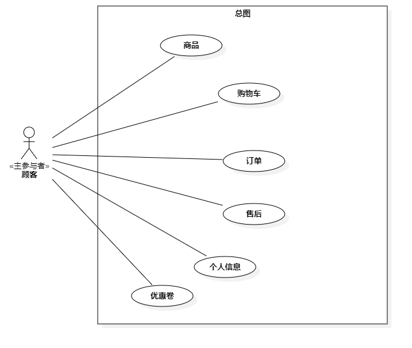
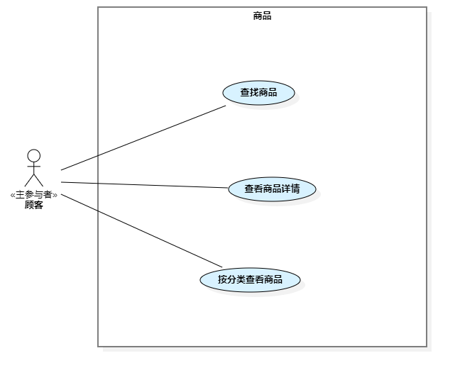

# OOMALL系统需求规格说明书

## 1. 引言
### 1.1  编写目的
   为明确支付系统需求、划清系统的边界、组织软件设计、开发与测试。
### 1.2  项目背景
   本项目是厦门大学信息学院软件工程专业《软件工程》《面向对象分析与设计》和《JavaEE平台技术》三门课程的联合课程设计。支付模块的设计和实现开始于2022年。2022年秋季学期由软件工程专业2020级学生完成第一次迭代，2023年秋季学期由软件工程专业2021级学生开始第二次迭代。
### 1.3 定义
   需求用例编号规则：
    格式为XXXX-REQ-XXX-XXX，含义如下表所示

| 系统名称      | 模块  | 顺序编号  |
|-----------|---|---|
| MALL – 商城 | PAY：支付模块  |  从001开始 |
| PRIV - 权限 | SHOP：商铺  |   |
|           | PRODUCT：商品模块  |   |
|           | PRIV：后台用户  |   |
|           | GATE – 权限网关  |   |
|           | ORDER：订单模块  |   |
|           | POST：售后模块  |   |
|           | CUST：顾客模块  |   |
|           | SERVICE：服务模块 |   |

###  1.4 参考资料
1. 中国人民银行办公厅. 关于进一步加强无证经验支付业务整治工作的通知. 银办发[2017]217号文
2. 中国人民银行. 关于规范支付创新业务通知. 银办发[2017]281号文
3. 中国人民银行. 关于印发 <条码支付业务规范（试行）>的通知. 银办发[2017]296号文
4. 郑志成. 京东到家支付平台的高可用性架构设计. https://www.zhihu.com/question/527868488/answer/2438919186
5. 微信支付. https://pay.weixin.qq.com/wiki/doc/apiv3/apis/chapter8_1_1.shtml
6. 支付宝互联网平台直付通产品. https://opendocs.alipay.com/open/02e7gm?ref=api

## 2 任务概述
### 2.1 目标
实现顾客可以在线购买商品。商户可以在线销售商品，平台可以监管整个过程。
### 2.2  运行环境
操作系统：Ubuntu 18.04 
支持环境：Docker， Tomcat 10.0.23 
数 据 库：MySQL
### 2.3  条件与限制
由于中国人民银行281号文的要求，支付系统需要基于分账模式完成用户的支付。微信支付基于服务商模式实现支付分账（https://pay.weixin.qq.com/wiki/doc/apiv3_partner/pages/index.shtml），支付宝系统基于互联网平台直付通实现支付分账（https://opendocs.alipay.com/open/00faww）。

## 3. 用例分析
### 3.1 参与者
#### 3.1.1 主参与者

| 主参与者|  主要目标 |
|---|---|
| 顾客  |  在系统中挑选商品，购买商品，进行售后服务 |
| 商户  |  为系统提供商品、跟据顾客的订单把商品配送给顾客，为顾客提供售后服务 |
|  服务商 |   为顾客提供售前和售后服务，或者单纯提供服务|
|   平台管理人员   |     审核商户和服务商，审核平台商品和活动                   |

#### 3.1.2 辅助参与者
| 辅助参与者|  提供的服务 |
|---|---|
| 仓库系统  | 提供商品拣货，库存管理等服务 |
|第三方支付平台 |  提供支付和退款，如支付宝和微信支付 |
|  物流系统 |   提供商品的配送，如顺丰、极兔和中通|
|   税务系统   |    提供发票                 |

#### 3.1.3 幕后参与者
| 幕后参与者| 所施加的影响                        |
|---|-------------------------------|
| 中国人民银行  | 需通过有支付牌照的第三方支付系统，以分账方式完成支付和退款 |
| 国家市场监督管理总局 | 对于所销售商品的资质要求                  |
|  工商行政管理部门   | 商品描述、活动促销是否满足广告法的要求           |

## 3.2 顾客

### 3.2.1 商品

#### 3.2.1.1 查找商品

| 用例编号：MALL-PRODUCT-001           | 用例名称：查找商品        |
|---------------------------------|------------------|
| 级别：用户目标                             |              |
| 描述： 顾客查找商品                      | |
| 触发事件： 顾客根据商品名称搜索查找商品 | |
| 主成功场景：                          | 信息               |
| 1.顾客输入商品名称，查询对应商品               |    商品名称              |
| 2. 系统根据搜索项，返回该商品名称所对应的在售商品和预售商品 |   商品名称，价格  |
| 扩展场景：                           | 信息               |
| 其他：                             |                |

#### 3.2.1.2 查看商品详情
| 用例编号：MALL-PRODUCT-002                            | 用例名称：查看商品详情              |
|--------------------------------------------------|--------------------------|
| 级别：用户目标                                          |                          |
| 描述： 顾客查看特定商品的详细信息                                |                          |
| 触发事件： 顾客选择特定商品                                   |                          |
| 主成功场景：                                           | 信息                       |
| 1. 顾客选择要查看的商品                                    |                          |
| 2. 系统显示该商品的详细信息，包括商品名称、 原价，销售价格、 相关 商品、 单位 、 产地 | 商品名称、 原价，销售价格、相关商品、单位、产地 |
| 扩展场景：                                            | 信息                       |
| 2a. 商品被禁售                                        |                          |
| &nbsp;&nbsp;1. 系统显示商品的名称、原价以及被禁售                 | 商品名称，原价，被禁售   |
| 其他：                                              |                          |

#### 3.2.1.3 按分类查看商品
| 用例编号：MALL-PRODUCT-003    | 用例名称：按分类查看商品 |
|--------------------------|--------------|
| 级别：用户目标                  |              |
| 描述： 顾客按商品的分类浏览商品列表       |              |
| 触发事件：  顾客选择分类类别          |              |
| 主成功场景：                   | 信息           |
| 1. 系统显示所有一级分类            | 一级分类名称       |
| 2. 顾客选择商品一级分类            |              | 
| 3. 系统显示所选一级分类下所有二级分类     | 二级分类名称       |
| 4.  顾客选择商品二级分类           |              |
| 5.  系统显示二级分类下的可售商品列表     | 商品名称，销售价格    |
| 扩展场景：                    | 信息           |
| 3a. 一级分类下无二级分类           |              |
| &nbsp;&nbsp;1. 系统不显示任何分类 |   |
| 5a. 二级分类下无商品           |              |
| &nbsp;&nbsp;1. 系统不显示商品列表 |   |
| 其他：                      |              |

