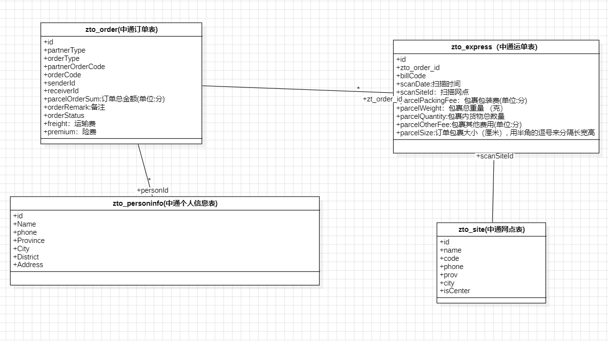

## 实现目标

| 接口                             | 名称         | 描述                                                         |
| -------------------------------- | ------------ | ------------------------------------------------------------ |
| zto.open.createOrder             | 创建订单接口 | 将订单信息同步至中通                                         |
| zto.open.cancelPreOrder          | 取消订单接口 | 取消同一appKey下的预约订单                                   |
| zto.open.getOrderInfo            | 查询订单接口 | 查询当前appKey创建的订单的详细信息（全网件、预约件），当查询全网件订单信息只能使用运单号。 |
| zto.merchant.waybill.track.query | 物流轨迹查询 | 物流轨迹查询                                                 |

## 创建订单接口

### 请求参数

| 名称             | 类型   | 描述                                                         |
| ---------------- | ------ | ------------------------------------------------------------ |
| partnerType      | string | 合作模式 ，1：集团客户；2：非集团客户                        |
| orderType        | string | partnerType为1时，orderType：1：全网件 2：预约件。 partnerType为2时，orderType：1：全网件 2：预约件（返回运单号） 3：预约件（不返回运单号） 4：星联全网件 |
| partnerOrderCode | string | 合作商订单号                                                 |
| senderInfo       | Object | 发件人信息 ,SenderInfoInput                                  |
| receiveInfo      | Object | 收件人信息 ,ReceiveInfoInput                                 |

### 响应参数

| 名称       | 类型    | 描述                                      |
| ---------- | ------- | ----------------------------------------- |
| message    | string  | 返回消息，错误情况详见错误码解释          |
| status     | boolean | 返回状态，true：调用成功；false：调用失败 |
| statusCode | string  | 返回状态Code，错误情况详见错误码解释      |

### 错误码

| 错误码  | 错误消息                                   | 解决方案                                                     |
| ------- | ------------------------------------------ | ------------------------------------------------------------ |
| DEF001  | 电子面单账号或者集团客户编码不能为空       | 1、集团客户模式下，customerId不能为空 ；2、非集团客户模式下，accountId不能为空 |
| F002    | 电子面单账户余额不足                       | 请联系网点充值                                               |
| p-o001  | 没有找到可以处理的订单类型                 | 检查orderType的值是否有问题                                  |
| p-o003  | 电子面单或者集团客户编码不存在或者没有绑定 | 使用正确的电子面单或者集团客户编码                           |
| p-ow002 | c端状态码返回成功，但是结果返回为空        | 联系中通对接人员                                             |

## 取消订单接口

### 请求参数

| 名称       | 类型   | 描述                                                         |
| ---------- | ------ | ------------------------------------------------------------ |
| cancelType | string | 取消类型 1不想寄了,2下错单,3重复下单,4运费太贵,5无人联系,6取件太慢,7态度差 |
| orderCode  | string | 预约件订单号（orderCode与billCode必传其一）                  |
| billCode   | string | 运单号（orderCode与billCode必传其一）                        |

### 响应参数

| 名称       | 类型    | 描述                                      |
| ---------- | ------- | ----------------------------------------- |
| message    | string  | 返回消息，错误情况详见错误码解释          |
| status     | boolean | 返回状态，true：调用成功；false：调用失败 |
| statusCode | string  | 返回状态Code，错误情况详见错误码解释      |

## 查询订单接口

### 请求参数

| 名称      | 类型    | 描述                                        |
| --------- | ------- | ------------------------------------------- |
| type      | integer | 0，预约件 1，全网件                         |
| orderCode | string  | 预约件订单号（orderCode与billCode必传其一） |
| billCode  | string  | 运单号（orderCode与billCode必传其一）       |

### 响应参数	

| 名称       | 类型    | 描述                                      |
| ---------- | ------- | ----------------------------------------- |
| message    | string  | 返回消息，错误情况详见错误码解释          |
| statusCode | string  | 返回状态Code，错误情况详见错误码解释      |
| status     | Boolean | 返回状态，true：调用成功；false：调用失败 |
| Order      | Object  | 返回的对象                                |

## 物流轨迹查询

### 请求参数

| 名称     | 类型   | 描述   |
| -------- | ------ | ------ |
| billCode | string | 运单号 |

### 响应参数

| 名称       | 类型    | 描述                                      |
| ---------- | ------- | ----------------------------------------- |
| status     | boolean | 返回状态，true：调用成功；false：调用失败 |
| message    | string  | 返回消息，错误情况详见错误码解释          |
| statusCode | string  | 返回状态Code，错误情况详见错误码解释      |
| scanDate   | date    | 扫描时间                                  |
| scanSite   | Object  | 扫描网点                                  |

### 错误码

| 错误码 | 错误消息                                 | 解决方案                           |
| ------ | ---------------------------------------- | ---------------------------------- |
| E403   | 参数校验失败                             | 请检查入参是否正确                 |
| E404   | 鉴权失败,未绑定电子面单账号              | 请绑定缺失的电子面单账号           |
| E409   | 鉴权失败,收寄人电话号码校验不一致        | 请使用正确的收件人、寄件人电话号码 |
| E413   | 鉴权失败,请输入收寄人任一方电话号码后4位 | 请输入收件人、寄件人电话号码后4位  |
| E500   | 未知系统异常                             | 未预期的异常，联系中通技术解决     |

## 公共错误码

​		

| 错误编码 | http状态码 | 返回信息       | 错误描述                       |
| -------- | ---------- | -------------- | ------------------------------ |
| S200     | 200        | 请求超时       | 后端服务调用超时               |
| S202     | 200        | 发生错误       | 后端服务调用抛出异常           |
| S203     | 200        | 服务暂不可用   | 服务暂不可用                   |
| S206     | 200        | api qos limit  | API调用次数达到每分钟/小时限制 |
| S207     | 200        | API不存在      | 请求的API不存在                |
| S208     | 200        | XX不能为空     | 没有传必须参数                 |
| S210     | 200        | 无权限访问     | 未绑定服务关系                 |
| S211     | 200        | 签名错误       | 签名不正确                     |
| S212     | 200        | IP黑白名单限制 | IP黑白名单限制                 |
| S214     | 200        | 时间戳非法     | 时间戳非法                     |

## 数据库

